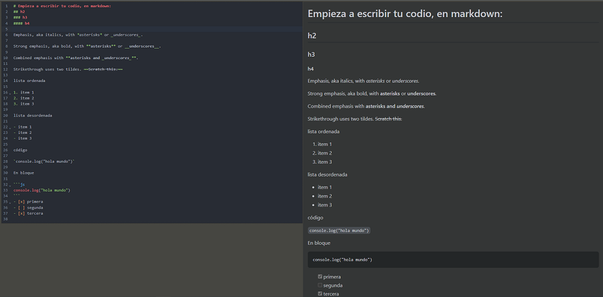

# Editor y Preview Markdown.



Utilizamos **React** y **Webpack**

## Librerias usadas 

- Code mirror
- react-markdown
- github-markdown.css

## Paso a Paso

- Hacemos _npm install_

```bash
npm install
```

- Para iniciar el proyecto en local:

```bash
npm start
```